# VELA 2.14 — FASE 10: Diagramas funcionales y de arquitectura

Estado: ESPECIFICACION VERSIONABLE  
Base: FASE 1–9  
Objetivo: representar visualmente la arquitectura REAL y la arquitectura OBJETIVO, diferenciando claramente IMPLEMENTADO / PARCIAL / FALTANTE.

Leyenda:
- IMPLEMENTADO: flujo existente en master.
- PARCIAL: existe parte sustancial, pero faltan piezas.
- FALTANTE: arquitectura objetivo aun no implementada.

---

# 1. Arquitectura funcional general

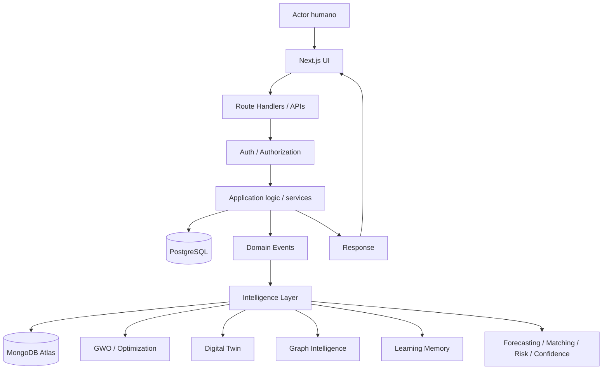

## Estado
- UI/API/PostgreSQL/Event Store/engines: IMPLEMENTADO.
- Atlas projection: PARCIAL.
- Change Streams/Trust/Realtime completo: FALTANTE.

---

# 2. Autorizacion contextual

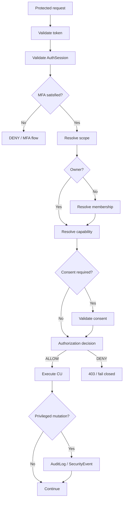

## Estado
- JWT/AuthSession/MFA: IMPLEMENTADO/PARCIAL.
- Membership/capability resolver: FALTANTE.
- Consent in selected flows: PARCIAL.

---

# 3. Build — secuencia Objective → Event Store → Intelligence

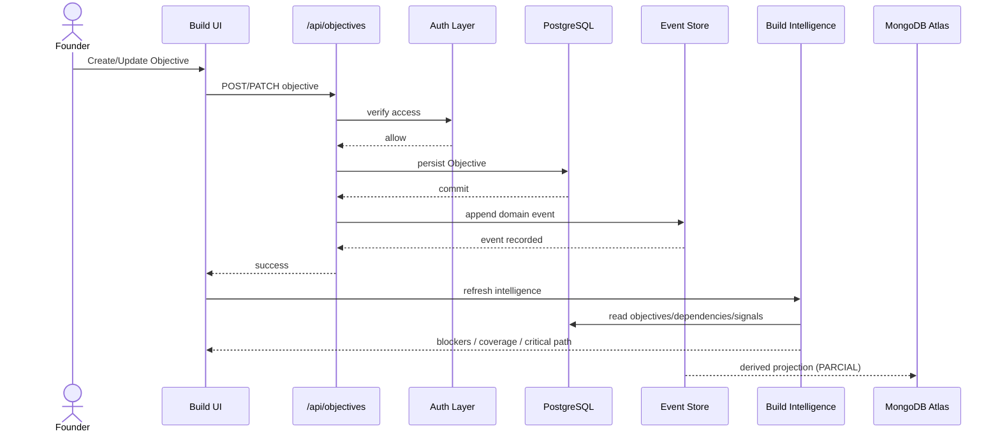

## Alternativas clave
- Auth fail → no persist.
- Invalid payload → no event.
- PostgreSQL fail → rollback/no event.
- Atlas fail after commit → operational success remains; replay later.

---

# 4. Validate — secuencia de evidencia

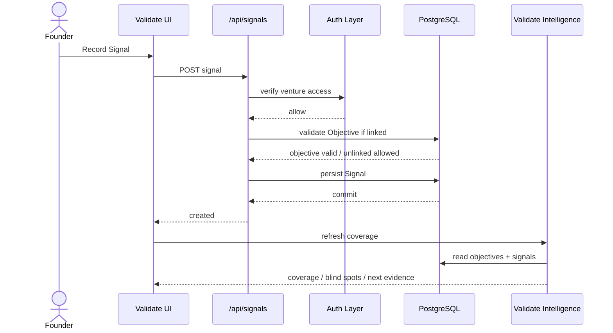

## Regla
Validate Intelligence puede recomendar evidencia, pero nunca crear evidencia empirica automaticamente.

---

# 5. Decision → Outcome → Learning Memory

```mermaid
sequenceDiagram
    actor Founder
    participant UI as Decision UI
    participant API as Decisions API
    participant PG as PostgreSQL
    participant ES as Event Store
    participant LM as Learning Memory
    participant Atlas as MongoDB Atlas

    Founder->>UI: Register decision
    UI->>API: POST decision
    API->>PG: persist decision
    PG-->>API: commit
    API->>ES: decision_created
    API-->>UI: success

    Note over Founder,UI: Later

    Founder->>UI: Record outcome
    UI->>API: PATCH decision outcome
    API->>PG: persist outcome
    PG-->>API: commit
    API->>ES: decision_outcome_recorded

    alt consolidate learning
        API->>PG: mark learned
        API->>ES: decision_learning_consolidated
        ES->>LM: process learning
        LM->>Atlas: store derived memory
    end

    alt Atlas unavailable
        LM--xAtlas: projection fails
        Note over PG,Atlas: PostgreSQL/Event Store remain canonical; replay later
    end
```

---

# 6. Team y capability-based collaboration

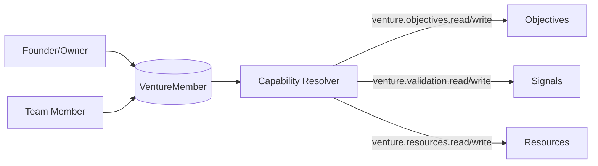

## Estado
- VentureMember: IMPLEMENTADO.
- Capability Resolver: FALTANTE.
- Owner-only behavior: IMPLEMENTADO.
- Member collaboration: PARCIAL.

---

# 7. Capital — flujo funcional completo

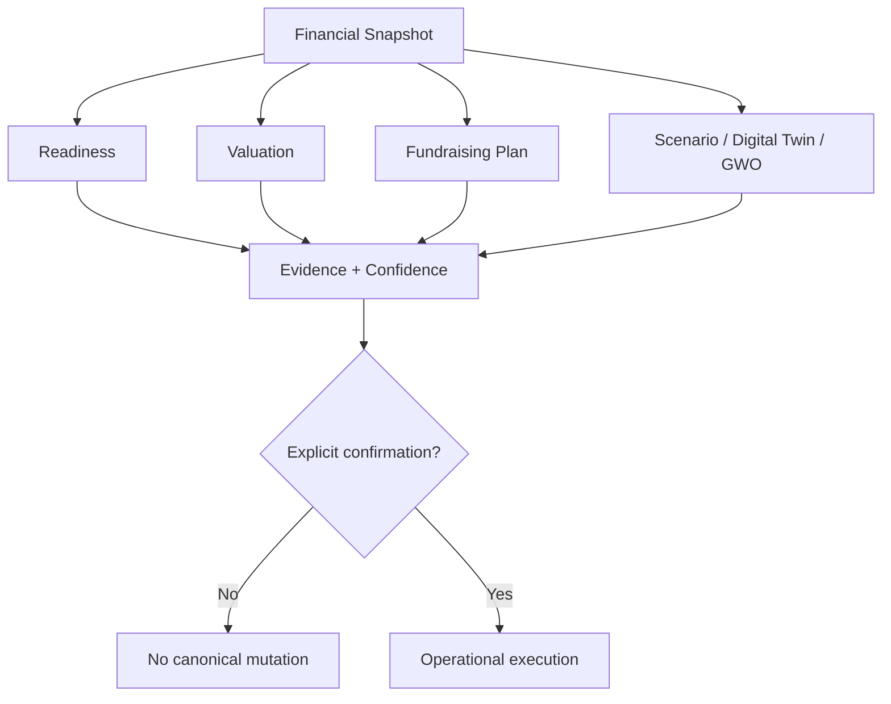

## Regla
Simulacion no equivale a ejecucion.

---

# 8. Risk / Organization Portfolio

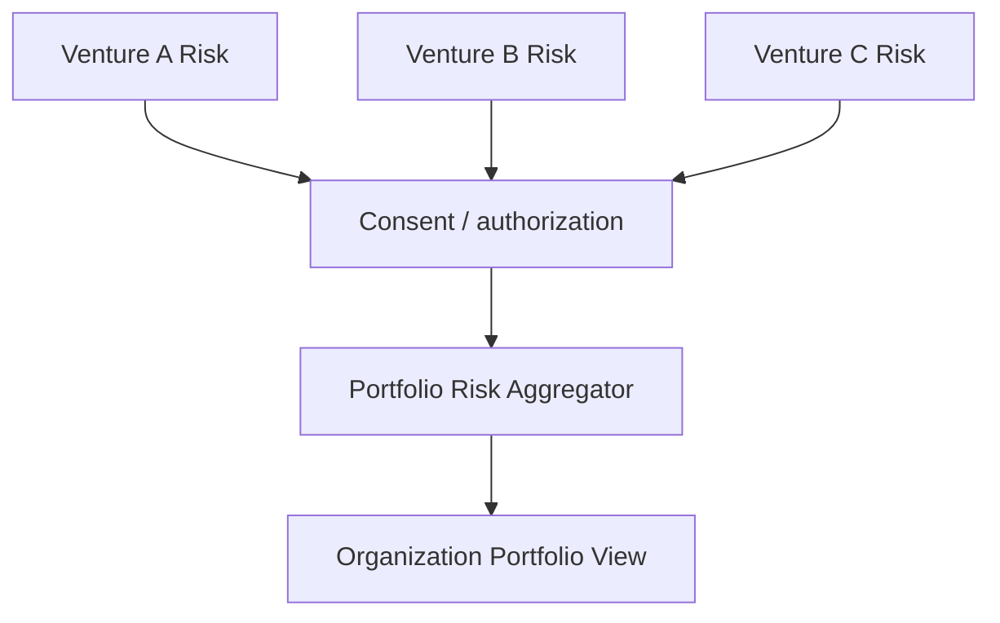

## Regla
El agregado organizacional no amplifica acceso a detalle privado.

## Estado
Organization auth: FALTANTE/PARCIAL.

---

# 9. Data Fabric 2.14 — arquitectura objetivo

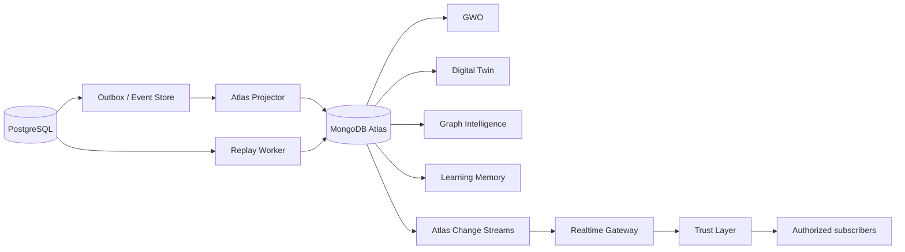

## Estado real
| Componente | Estado |
|---|---|
| PostgreSQL | IMPLEMENTADO |
| Event Store | IMPLEMENTADO |
| Transactional Outbox | FALTANTE |
| Atlas projector | PARCIAL |
| GWO | IMPLEMENTADO |
| Digital Twin | IMPLEMENTADO |
| Graph | IMPLEMENTADO |
| Learning Memory | IMPLEMENTADO/PARCIAL |
| Change Streams | FALTANTE |
| Realtime Gateway real | PARCIAL |
| Trust Layer | FALTANTE |
| Replay | PARCIAL en Draft PR |

---

# 10. Data Fabric — secuencia de escritura canonica

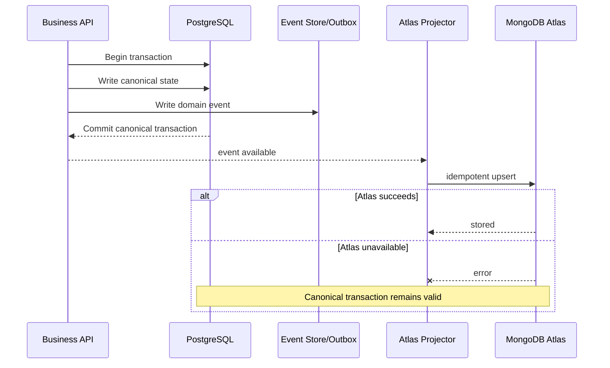

## Arquitectura objetivo
El evento debe quedar atomicamente garantizado junto al estado canonico mediante outbox/transaccion.

---

# 11. Change Streams → Trust → Realtime

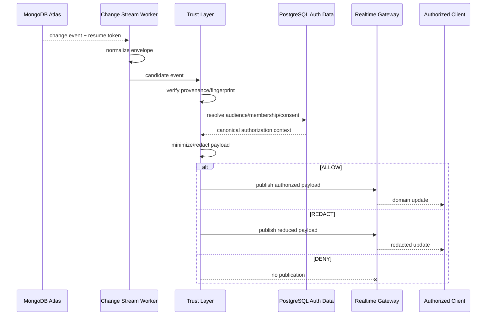

## Regla
Fail closed si no puede resolverse audience, provenance o consent.

---

# 12. Replay de recuperacion

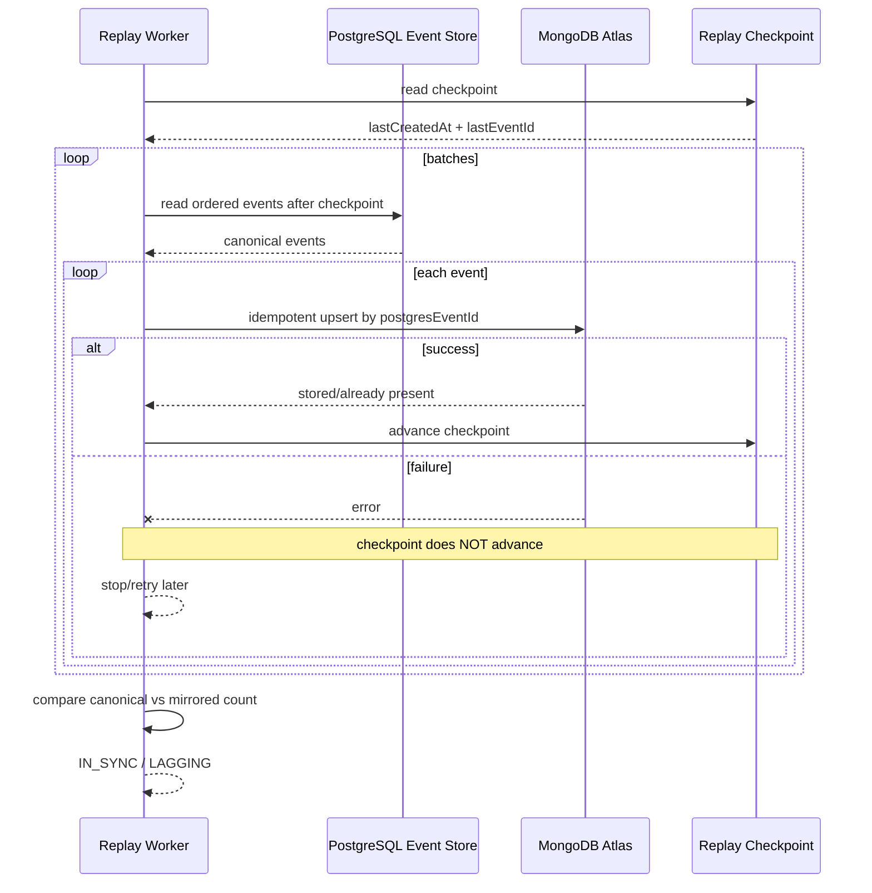

---

# 13. Trust Layer — decision tree

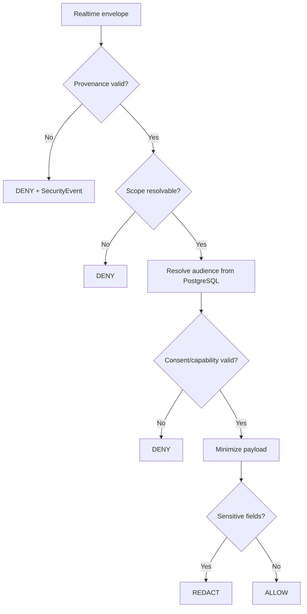

---

# 14. UI state machine comun

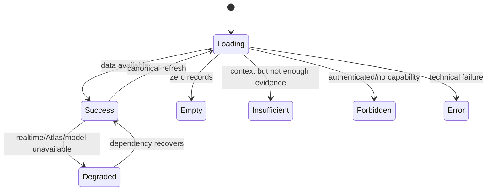

## Regla
Empty, Insufficient y Error son estados distintos.

---

# 15. Flujo de una mutacion segura

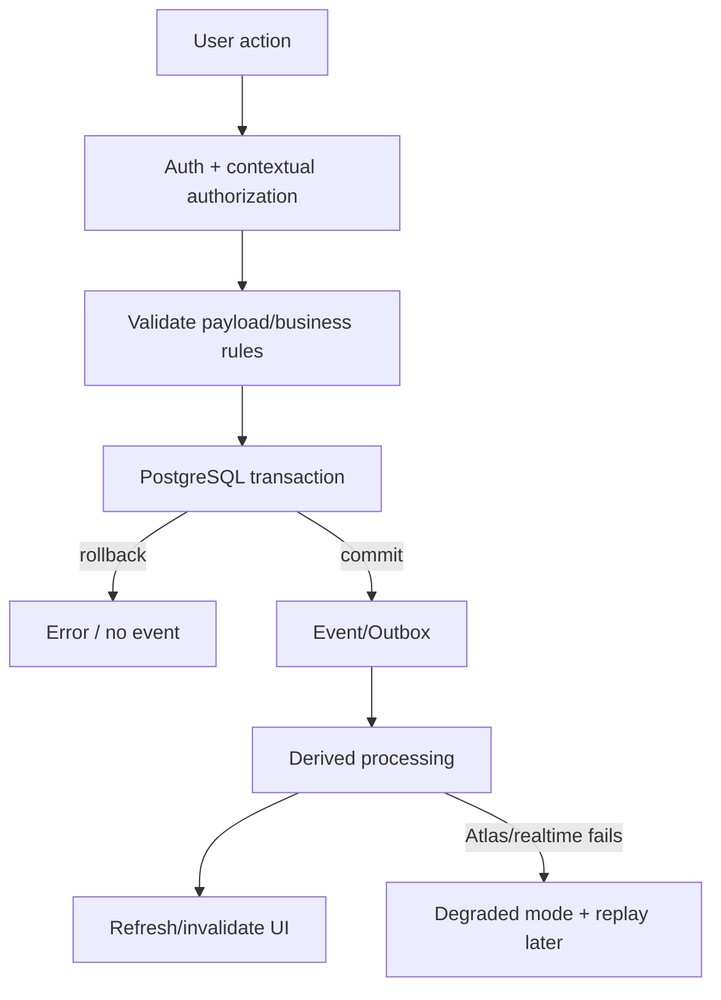

---

# 16. Diagrama de trazabilidad funcional

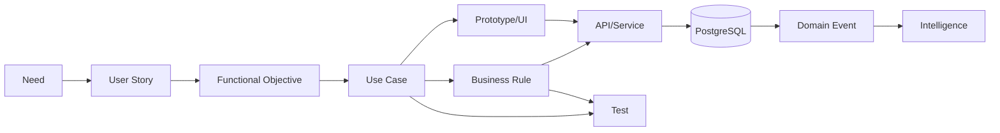

---

# 17. Diagramas por estado de implementacion

## IMPLEMENTADO
- AuthSession/MFA (parcial en guards legacy).
- Command/Home.
- Build owner.
- Validate owner.
- Team membership.
- Resources owner.
- Capital core.
- Risk venture.
- Event Store.
- GWO.
- Digital Twin.
- Graph Intelligence.
- Learning Memory base.

## PARCIAL
- Team member collaboration.
- Organization portfolio.
- Investor access.
- Atlas projection.
- Learning Memory 2.14.
- Realtime abstraction/SSE.
- Replay branch.

## FALTANTE
- Capability Resolver general.
- Transactional Outbox real.
- Atlas Change Streams.
- Trust Layer.
- Realtime Gateway production.
- Organization authorization complete.
- Data Fabric Health UI.

---

# 18. Salida para FASE 11

FASE 11 debe construir la matriz maestra:

HU | CU | Actor | Flujo | Alternativas | RN | UI | API | Servicio | PostgreSQL | MongoDB | Motor | Prueba | Estado

Debe permitir rastreo directo e inverso:

HU → CU → RN → UI → API → Datos → Inteligencia → TEST

y:

TEST/API/Dato → CU → HU.
