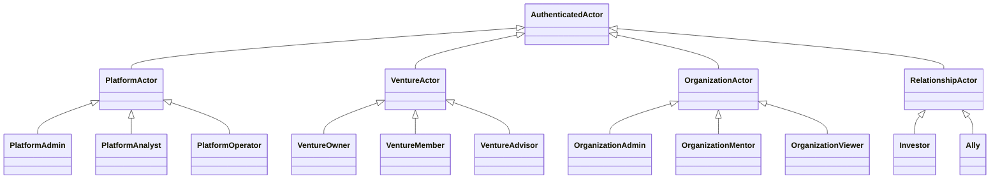
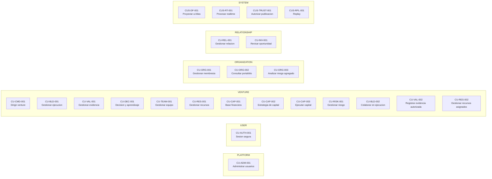
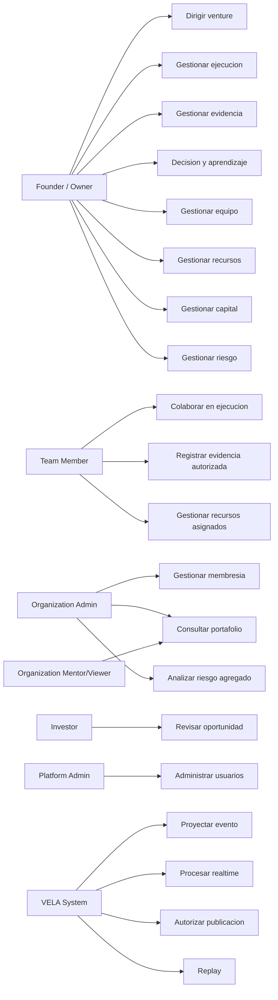
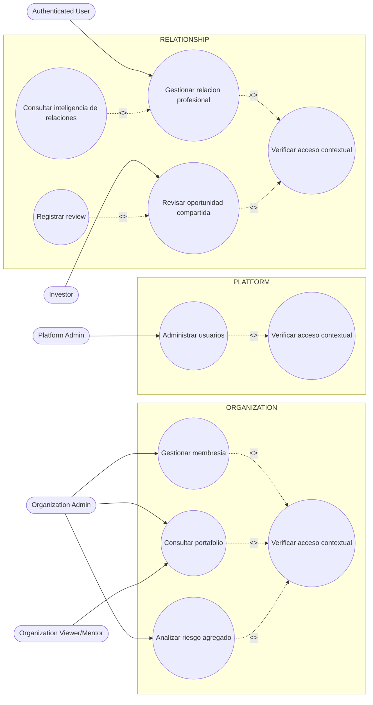
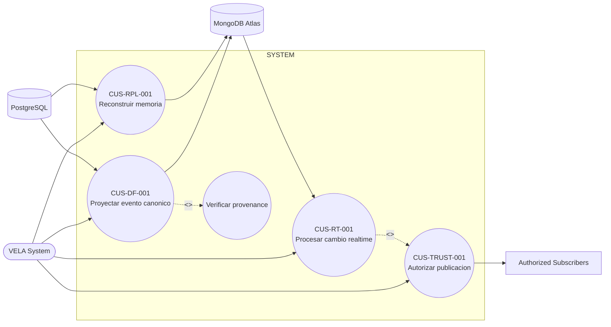

# VELA 2.14 — FASE 8: Relaciones UML y diagramas de casos de uso

Estado: ESPECIFICACION UML FUNCIONAL  
Base: FASE 1–7  
Objetivo: formalizar actores, generalizaciones, fronteras, relaciones `<<include>>` y `<<extend>>` sin confundir secuencia con reutilizacion.

## 1. Principios UML aplicados

1. `<<include>>` se usa solo cuando el comportamiento es obligatorio y reutilizable.
2. `<<extend>>` se usa solo cuando el comportamiento es condicional u opcional.
3. Una precondicion no se convierte automaticamente en `include`.
4. Dos CU consecutivos no implican `include`.
5. La persistencia PostgreSQL, Atlas, eventos y motores no son actores humanos.
6. VELA System se modela como actor tecnico para CU internos.
7. Las fronteras principales son PLATFORM, USER, VENTURE, ORGANIZATION, RELATIONSHIP y SYSTEM.

---

# 2. Generalizacion de actores



## Justificacion

- `PlatformAdmin`, `PlatformAnalyst` y `PlatformOperator` especializan privilegios globales.
- `VentureOwner`, `VentureMember` y `VentureAdvisor` comparten contexto VENTURE, pero no capacidades.
- `OrganizationAdmin`, `OrganizationMentor` y `OrganizationViewer` comparten membership organizacional.
- Investor/Ally representan relaciones contextuales, no roles globales.
- La generalizacion es conceptual; no implica herencia TypeScript.

---

# 3. Mapa general de fronteras y CU



---

# 4. Actores y asociaciones principales



---

# 5. Relaciones `<<include>>` definitivas

## 5.1 Verificar acceso contextual

El unico include transversal humano obligatorio es:

```
CU protegido
  <<include>>
CU-AUTH-Z01 Verificar acceso contextual
```

Aplica a:

- CU-CMD-001
- CU-BLD-001
- CU-VAL-001
- CU-DEC-001
- CU-TEAM-001
- CU-RES-001
- CU-CAP-001
- CU-CAP-002
- CU-CAP-003
- CU-RISK-001
- CU-BLD-002
- CU-VAL-002
- CU-RES-002
- CU-ORG-001
- CU-ORG-002
- CU-ORG-003
- CU-INV-001
- CU-REL-001
- CU-ADM-001

### Justificacion
Todos requieren autenticacion y, segun el caso, resolucion de scope/membership/capability. Es obligatorio y reutilizable.

## 5.2 Trust Layer en Realtime

```
CUS-RT-001
  <<include>>
CUS-TRUST-001
```

### Justificacion
Ningun evento derivado puede publicarse sin decision ALLOW/DENY/REDACT. No es opcional.

## 5.3 Verificar provenance en Data Fabric

```
CUS-DF-001
  <<include>>
Verificar provenance e integridad
```

### Justificacion
Toda proyeccion derivada debe mantener trazabilidad/fingerprint/version.

---

# 6. Relaciones que NO son `include`

## CU-CAP-002 y CU-CAP-001

Antes se describio una relacion posible de include. FASE 7 muestra que **Gestionar base financiera no debe ejecutarse automaticamente desde Evaluar estrategia de capital**.

Relacion correcta:

- CU-CAP-001 produce una precondicion/dato requerido para algunos subflujos.
- CU-CAP-002 verifica que la base exista.
- Si no existe, termina/dirige al actor a CU-CAP-001.

Por tanto:

```
CU-CAP-001 --precondition for--> CU-CAP-002
```

No `<<include>>`.

## CU-BLD-001 y Sprint/Gate

Gestionar sprint y gate no son obligatorios en toda ejecucion.

Por tanto son extensiones, no includes.

---

# 7. Relaciones `<<extend>>` definitivas

| Caso base | Extension | Condicion |
|---|---|---|
| CU-CMD-001 | Iniciar intervencion | founder decide actuar |
| CU-CMD-001 | Consultar Learning Memory | existe memoria relevante |
| CU-BLD-001 | Analizar dependencias | existen objetivos/dependencias suficientes |
| CU-BLD-001 | Gestionar sprint | actor decide trabajar con cadencia |
| CU-BLD-001 | Gestionar gate | proceso necesita criterio de avance |
| CU-VAL-001 | Vincular evidencia | Signal se relaciona con Objective |
| CU-VAL-001 | Sugerir siguiente evidencia | inteligencia tiene suficiente contexto |
| CU-VAL-001 | Eliminar evidencia | actor solicita eliminacion |
| CU-DEC-001 | Registrar resultado | existe outcome |
| CU-DEC-001 | Consolidar aprendizaje | actor decide promover aprendizaje |
| CU-TEAM-001 | Analizar capacidad | existe roster/datos suficientes |
| CU-RES-001 | Analizar salud de recursos | existen recursos |
| CU-CAP-002 | Simular escenario | actor solicita simulacion |
| CU-CAP-002 | Generar fundraising plan | existe base suficiente |
| CU-INV-001 | Registrar review | investor posee capability de review |
| CU-REL-001 | Consultar inteligencia de relaciones | actor solicita analisis |
| CU-AUTH-001 | Completar MFA | sesion requiere segundo factor |
| CU-AUTH-001 | Revocar sesion | usuario/admin solicita revocacion |

---

# 8. Diagrama UML funcional — Venture

```mermaid
flowchart LR
    Founder([Founder / Owner])
    Member([Team Member])

    subgraph VENTURE_SCOPE[VELA · VENTURE]
      AUTHZ((Verificar acceso contextual))
      CMD((Dirigir venture))
      BLD((Gestionar ejecucion))
      VAL((Gestionar evidencia))
      DEC((Gestionar decision y aprendizaje))
      TEAM((Gestionar equipo))
      RES((Gestionar recursos))
      CAP1((Gestionar base financiera))
      CAP2((Evaluar estrategia de capital))
      CAP3((Ejecutar plan de capital))
      RISK((Gestionar riesgo))
      BLD2((Colaborar en ejecucion))
      VAL2((Registrar evidencia autorizada))
      RES2((Gestionar recursos asignados))

      INTERV((Iniciar intervencion))
      MEMORY((Consultar Learning Memory))
      DEP((Analizar dependencias))
      SPRINT((Gestionar sprint))
      GATE((Gestionar gate))
      LINK((Vincular evidencia))
      NEXT((Sugerir siguiente evidencia))
      OUTCOME((Registrar resultado))
      LEARN((Consolidar aprendizaje))
      CAPACITY((Analizar capacidad))
      HEALTH((Analizar salud de recursos))
      SIM((Simular escenario))
      FUND((Generar fundraising))
    end

    Founder --> CMD
    Founder --> BLD
    Founder --> VAL
    Founder --> DEC
    Founder --> TEAM
    Founder --> RES
    Founder --> CAP1
    Founder --> CAP2
    Founder --> CAP3
    Founder --> RISK

    Member --> BLD2
    Member --> VAL2
    Member --> RES2

    CMD -. "<<include>>" .-> AUTHZ
    BLD -. "<<include>>" .-> AUTHZ
    VAL -. "<<include>>" .-> AUTHZ
    DEC -. "<<include>>" .-> AUTHZ
    TEAM -. "<<include>>" .-> AUTHZ
    RES -. "<<include>>" .-> AUTHZ
    CAP1 -. "<<include>>" .-> AUTHZ
    CAP2 -. "<<include>>" .-> AUTHZ
    CAP3 -. "<<include>>" .-> AUTHZ
    RISK -. "<<include>>" .-> AUTHZ
    BLD2 -. "<<include>>" .-> AUTHZ
    VAL2 -. "<<include>>" .-> AUTHZ
    RES2 -. "<<include>>" .-> AUTHZ

    INTERV -. "<<extend>>" .-> CMD
    MEMORY -. "<<extend>>" .-> CMD
    DEP -. "<<extend>>" .-> BLD
    SPRINT -. "<<extend>>" .-> BLD
    GATE -. "<<extend>>" .-> BLD
    LINK -. "<<extend>>" .-> VAL
    NEXT -. "<<extend>>" .-> VAL
    OUTCOME -. "<<extend>>" .-> DEC
    LEARN -. "<<extend>>" .-> DEC
    CAPACITY -. "<<extend>>" .-> TEAM
    HEALTH -. "<<extend>>" .-> RES
    SIM -. "<<extend>>" .-> CAP2
    FUND -. "<<extend>>" .-> CAP2
```



---

# 9. Diagrama UML funcional — Organization / Relationship / Platform



---

# 10. Diagrama UML funcional — SYSTEM / Data Fabric



---

# 11. Relaciones de dependencia no-UML

Estas relaciones se documentan como dependencias, no `include/extend`:

| Origen | Destino | Tipo |
|---|---|---|
| CU-CAP-001 | CU-CAP-002 | produce baseline/precondicion |
| CU-TEAM-001 | CU-BLD-002 | habilita membership |
| CU-TEAM-001 | CU-VAL-002 | habilita membership |
| CU-TEAM-001 | CU-RES-002 | habilita membership |
| CU-REL-001 | CU-INV-001 | puede preceder sharing, no autoriza |
| CU-ORG-001 | CU-ORG-002/003 | membership contextual |
| CUS-DF-001 | CUS-RT-001 | Atlas derivado produce cambios |
| CUS-RPL-001 | CUS-DF-001 | reutiliza reglas de proyeccion/idempotencia |

---

# 12. Matriz de justificacion UML

| Relacion | Se mantiene | Razon |
|---|---|---|
| CU protegido include AUTH-Z01 | SI | obligatorio y reutilizable |
| CUS-RT include TRUST | SI | toda publicacion debe pasar Trust |
| DF include provenance | SI | integridad obligatoria |
| CAP2 include CAP1 | NO | CAP1 es precondicion, no subflujo obligatorio |
| Build include Sprint | NO | sprint es opcional |
| Build extend Sprint | SI | solo si actor usa cadencia |
| Build extend Gate | SI | solo si existe gate |
| Validate extend Link Evidence | SI | objectiveId es opcional |
| Decision extend Outcome | SI | outcome ocurre posteriormente |
| Decision extend Learning | SI | consolidacion es opcional |
| Relation include Membership | NO | connection no concede access |
| Investor include Consent | NO como CU | consentimiento es regla/precondicion dentro AUTH-Z01 |
| Realtime include Trust | SI | fail-closed obligatorio |

---

# 13. Reglas UML derivadas para implementacion

1. Ninguna pantalla debe inferir privilegio por tipo de actor sin consultar autorizacion contextual.
2. Los includes de AUTH-Z01 deben materializarse como middleware/guard/service reusable, no codigo duplicado.
3. Los extends no deben ejecutarse automaticamente si su condicion no se cumple.
4. Los CU SYSTEM no deben exponerse como acciones de usuario salvo endpoints administrativos expresamente protegidos.
5. Las dependencias de datos no deben modelarse como includes.
6. Realtime y Replay pueden fallar sin invalidar un CU humano ya confirmado en PostgreSQL.
7. Trust Layer es obligatorio antes de cualquier publicacion derivada de Change Streams.

---

# 14. Salida para FASE 9 — Prototipos

FASE 9 debe derivar pantallas desde estos CU, no al contrario.

Cada UI debe indicar:
- ID;
- actor;
- CU;
- objetivo;
- componentes;
- campos;
- validaciones;
- estados;
- acciones;
- errores;
- loading;
- empty;
- success;
- permisos;
- responsive behavior;
- endpoint/servicio asociado.

Las UI deben reutilizar componentes y lenguaje visual actuales de VELA. No deben crear pantallas para CU SYSTEM salvo observabilidad/admin cuando exista una necesidad real.
