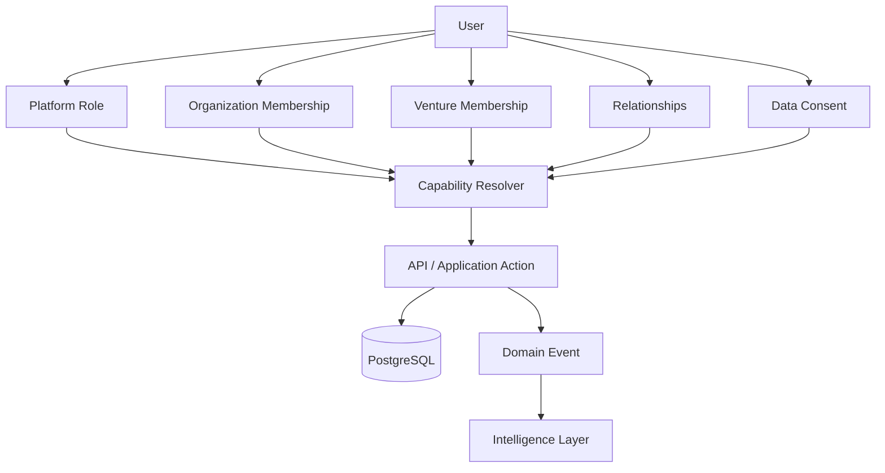
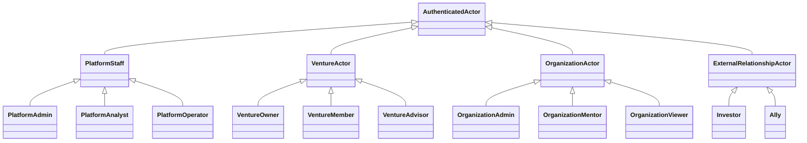

# VELA 2.14 — FASE 2: Actores, scopes y permisos

Estado: ESPECIFICACION FUNCIONAL DERIVADA DEL REPOSITORIO  
Base auditada: `master`  
Objetivo: definir actores reales y separar identidad, rol de plataforma, pertenencia organizacional, pertenencia a venture y permisos, sin modificar aun el modelo de datos ni la autorizacion.

---

## 1. Principio de autorizacion propuesto

VELA no debe tratar "actor" y "UserRole" como sinonimos.

La arquitectura existente ya contiene tres niveles conceptualmente distintos:

1. **Rol de plataforma**
   - Persistido en `User.role`.
   - Valores actuales: `admin`, `analista`, `operador`.
   - Controla privilegios globales de VELA.

2. **Rol dentro de una organizacion**
   - Persistido en `OrganizationUser.role`.
   - Valores sugeridos actualmente por comentario de schema: `admin`, `mentor`, `viewer`.
   - Debe controlar acciones sobre una organizacion y su portafolio.

3. **Rol dentro de un venture**
   - Persistido en `VentureMember.role`.
   - Actualmente es texto libre.
   - Debe controlar colaboracion y acciones dentro del venture.

Por lo tanto, un mismo usuario puede ser simultaneamente:

```
User.role = operador
OrganizationUser.role = mentor
VentureMember.role = advisor
```

sin que exista contradiccion.

---

## 2. Actores reales encontrados

### ACT-PLT-001 — Administrador de VELA

**Origen actual:** `User.role = admin`

Responsabilidades observadas:

- administracion de usuarios;
- contenido administrativo;
- waitlist;
- estadisticas globales;
- acceso cross-user en varias APIs;
- operaciones de seguridad;
- acciones administrativas de plataforma.

Scope principal:

```
PLATFORM
```

Estado: **IMPLEMENTADO**

Limitacion actual:

Algunas APIs administrativas usan `requireRole()` en lugar de `requireAuth()`, por lo que no todas aplican verificacion de sesion revocada y MFA.

---

### ACT-PLT-002 — Analista de VELA

**Origen actual:** `User.role = analista`

Responsabilidades observadas:

- acceso al dashboard;
- lectura de informacion analitica;
- determinadas lecturas cross-user;
- analisis de ecosistema/plataforma.

Scope principal:

```
PLATFORM_ANALYTICS
```

Estado: **IMPLEMENTADO/PARCIAL**

Restriccion recomendada:

Un analista no debe recibir implicitamente privilegios de escritura sobre ventures ajenos.

---

### ACT-PLT-003 — Operador de VELA

**Origen actual:** `User.role = operador`

Representa el usuario autenticado normal de la plataforma.

Puede utilizar los modulos operativos cuando los recursos pertenecen a su propio scope.

Estado: **IMPLEMENTADO**

Problema semantico:

En la experiencia de producto puede representar un founder, integrante, mentor u otro actor de negocio. Por ello `operador` no debe utilizarse como sustituto de esos actores.

---

### ACT-VEN-001 — Propietario / Founder del venture

**Origen actual:**

```
Venture.userId
```

El modelo `Venture` contiene `userId @unique`, por lo que existe actualmente un unico propietario canonico.

Acciones actuales observadas:

- crear su venture;
- consultar su venture;
- crear y modificar objetivos;
- registrar señales;
- gestionar gates;
- gestionar miembros;
- gestionar recursos;
- gestionar capital;
- ejecutar escenarios;
- gestionar riesgo;
- consultar inteligencia;
- crear decisiones;
- consultar Command.

Scope:

```
VENTURE_OWNER
```

Estado: **IMPLEMENTADO**

Limitacion estructural:

La mayoria de APIs resuelven el venture mediante:

```ts
prisma.venture.findUnique({ where: { userId: session.sub } })
```

Esto hace que los miembros de un venture no puedan operar sobre el mismo venture aunque exista un `VentureMember`.

---

### ACT-VEN-002 — Integrante de equipo

**Origen actual:**

```
VentureMember
```

Campos relevantes:

- `ventureId`
- `userId`
- `role`
- `responsibility`
- `status`

Estado: **PARCIAL**

El sistema usa membresias para:

- inteligencia de equipo;
- capacidad;
- asignaciones;
- Knowledge Graph;
- Person State.

Pero las membresias **no se usan como mecanismo general de autorizacion**.

Por tanto hoy un integrante puede estar modelado como miembro sin necesariamente poder operar Build, Validate, Team, Resources o Capital sobre ese venture.

---

### ACT-VEN-003 — Co-founder

No existe un tipo dedicado.

Debe representarse como especializacion de `VentureMember`, no como nuevo `UserRole`.

Estado: **DISEÑADO**

Capacidades propuestas para posterior especificacion:

- lectura completa del venture;
- crear/modificar objetivos;
- registrar evidencia;
- gestionar equipo segun permiso;
- consultar inteligencia;
- participar en decisiones;
- acceso a capital segun capability.

No se implementa en Fase 2.

---

### ACT-VEN-004 — Colaborador / Operador del venture

Puede corresponder a un `VentureMember.role` especializado.

Estado: **DISEÑADO/PARCIAL**

Debe tener permisos asignados al scope de venture y no privilegios globales de VELA.

---

### ACT-VEN-005 — Mentor / Advisor del venture

Actualmente puede aparecer de dos maneras diferentes:

- `UserConnection.type = mentor`;
- `OrganizationUser.role = mentor`;
- potencialmente `VentureMember.role = mentor/advisor`.

Estas tres relaciones NO son equivalentes:

```
UserConnection mentor
= relacion social/profesional

OrganizationUser mentor
= rol dentro de una organizacion

VentureMember advisor
= participacion dentro de un venture
```

Estado: **PARCIAL / SEMANTICA NO NORMALIZADA**

Recomendacion:

No otorgar permisos de venture por el simple hecho de existir una conexion `mentor`.

---

### ACT-ORG-001 — Administrador de organizacion

**Origen actual esperado:**

```
OrganizationUser.role = admin
```

Scope:

```
ORGANIZATION
```

Capacidades esperables por el dominio ya existente:

- administrar miembros de organizacion;
- consultar cohorts;
- consultar ventures asociados;
- consultar riesgo de portafolio;
- administrar consentimientos;
- consultar inteligencia agregada.

Estado: **DISEÑADO EN MODELO / FALTANTE EN AUTORIZACION**

No se encontro una capa general de autorizacion basada en `OrganizationUser.role`.

---

### ACT-ORG-002 — Mentor de organizacion

**Origen actual esperado:**

```
OrganizationUser.role = mentor
```

Estado: **DISEÑADO EN MODELO / FALTANTE EN AUTORIZACION**

Debe poder acceder solo a ventures/cohorts expresamente autorizados o relacionados con la organizacion.

---

### ACT-ORG-003 — Visor de organizacion

**Origen actual esperado:**

```
OrganizationUser.role = viewer
```

Estado: **DISEÑADO EN MODELO / FALTANTE EN AUTORIZACION**

Debe ser read-only.

---

### ACT-INV-001 — Inversionista

No existe actualmente un rol persistido equivalente.

Existen:

- InvestmentOpportunity;
- InvestmentReview;
- SOFTBOX investors;
- matching de inversionistas.

Esto representa funcionalidad de inversion, pero no una identidad autorizable de inversionista.

Estado: **FALTANTE COMO ACTOR DE AUTORIZACION**

Recomendacion:

No agregar `investor` a `UserRole` global automaticamente.

Debe modelarse mediante membresia/relacion/capability cuando los casos de uso lo requieran.

---

### ACT-ALLY-001 — Aliado externo

No existe como rol formal.

Puede estar conceptualmente relacionado con:

- Organization;
- UserConnection;
- Network;
- Partner Matching.

Estado: **FALTANTE COMO ACTOR FORMAL**

---

### ACT-SYS-001 — VELA System

Actor no humano.

Ejecuta:

- Event Store;
- motores de inteligencia;
- Learning Memory;
- Digital Twin;
- Graph Intelligence;
- algoritmos;
- Data Fabric;
- security monitoring;
- futuros Change Streams/replay.

Estado: **IMPLEMENTADO/PARCIAL**

Este actor nunca debe recibir permisos a traves de una sesion humana.

---

## 3. Matriz maestra de actores

| Actor | Modulos actuales/relevantes | Acciones | Restricciones | Scope | Estado |
|---|---|---|---|---|---|
| Administrador VELA | Admin, Dashboard, Security, contenido, plataforma | Administrar plataforma y usuarios | Debe auditar acciones privilegiadas | PLATFORM | IMPLEMENTADO |
| Analista VELA | Dashboard, intelligence, portfolio | Analizar y consultar | No debe modificar ownership ajeno por defecto | PLATFORM_ANALYTICS | PARCIAL |
| Operador VELA | Modulos de producto | Operar sus recursos | Limitado por ownership actual | USER | IMPLEMENTADO |
| Founder/Owner | Command, Build, Validate, Capital, Risk, Venture, Team, Resources | Control integral de su venture | Solo venture propio | VENTURE_OWNER | IMPLEMENTADO |
| Co-founder | Venture modules | Colaborar y decidir | Requiere membresia/capabilities | VENTURE | DISEÑADO |
| Team member | Team, Build, Validate, Resources | Ejecutar trabajo asignado | No debe administrar todo por defecto | VENTURE | PARCIAL |
| Advisor/Mentor venture | Intelligence, Validate, Relay | Revisar, comentar, recomendar | Read/write limitado | VENTURE | DISEÑADO/PARCIAL |
| Organization admin | Portfolio, cohorts, risk, org users | Administrar organizacion | Solo organizacion propia | ORGANIZATION | FALTANTE EN AUTH |
| Organization mentor | Portfolio/ventures asignados | Mentorizar | Sin privilegios administrativos | ORGANIZATION | FALTANTE EN AUTH |
| Organization viewer | Portfolio | Consultar | Read-only | ORGANIZATION | FALTANTE EN AUTH |
| Inversionista | Investment/Softbox | Revisar oportunidades autorizadas | Sin acceso implicito a datos privados | RELATIONSHIP/ORG | FALTANTE |
| Aliado | Network/Relay/Partner matching | Colaborar | Segun consentimiento | RELATIONSHIP | FALTANTE |
| VELA System | Intelligence/Data Fabric | Procesar eventos/estados | Least privilege tecnico | SYSTEM | PARCIAL |

---

## 4. Matriz por modulo

Leyenda:

- **W** escritura
- **R** lectura
- **A** administracion
- **-** sin acceso implicito
- **C** condicionado por membership/capability

| Modulo | Platform Admin | Analyst | Founder | Team member | Mentor | Org admin | Org viewer |
|---|---:|---:|---:|---:|---:|---:|---:|
| Command | C/R | C/R | R | C/R | C/R | C/R | C/R |
| Build | C | C/R | W | C | C/R | C/R | R |
| Validate | C | C/R | W | C | C/R | C/R | R |
| Capital | C | C/R | W | C | C/R | C/R | R |
| Risk | C | C/R | W | C | C/R | C/R | R |
| Protection | C | - | W | C | C | - | - |
| Relay | A/C | C | W | C/W | C/W | C | R |
| Network | A/C | C | W | W | W | C | R |
| Venture | C | C/R | W | C | C/R | C/R | R |
| Team | C | C/R | A/W | C/R | R | C/R | R |
| Resources | C | C/R | W | C/W | R | C/R | R |
| Investment | C | C/R | W | C | C/R | C/R | R |
| Organization/Portfolio | A | R | C | C | C | A/W | R |
| Admin | A | - | - | - | - | - | - |

Esta tabla representa el **modelo objetivo a validar en casos de uso**, no permisos ya implementados.

---

## 5. Scopes de autorizacion

Se establecen los siguientes scopes conceptuales.

### SCP-001 — PLATFORM

Recursos globales de VELA.

Ejemplos:

- usuarios;
- configuracion global;
- seguridad;
- contenido administrativo;
- estadisticas globales.

### SCP-002 — USER

Datos privados de una persona.

Ejemplos:

- perfil;
- sesiones;
- Financial Protection personal;
- consentimientos;
- memoria personal autorizada.

### SCP-003 — ORGANIZATION

Datos pertenecientes a una organizacion.

Ejemplos:

- cohorts;
- portfolio;
- portfolio risk;
- organization users;
- datos agregados.

### SCP-004 — VENTURE

Datos de un venture.

Ejemplos:

- objetivos;
- señales;
- team;
- resources;
- financial snapshots;
- capital;
- risk;
- Digital Twin.

### SCP-005 — RELATIONSHIP

Datos cuyo acceso nace de una relacion autorizada.

Ejemplos:

- mentorias;
- connections;
- investor access;
- partner access;
- data consent.

### SCP-006 — SYSTEM

Procesamiento interno.

Ejemplos:

- Event Store;
- Atlas projection;
- Change Streams;
- replay;
- learning;
- governance;
- model execution.

---

## 6. Regla de resolucion de permisos propuesta

Toda accion futura debe evaluarse conceptualmente asi:

```
authenticated?
    ↓
session active?
    ↓
MFA satisfied?
    ↓
account active?
    ↓
platform role permits route?
    ↓
resolve resource scope
    ↓
resolve membership / ownership
    ↓
resolve capability
    ↓
check consent when required
    ↓
allow / deny
    ↓
audit privileged mutation
```

No debe bastar con:

```ts
session.role === "admin"
```

ni con:

```ts
resource.ownerId === session.sub
```

para todos los casos.

---

## 7. Capacidades conceptuales

No se implementan aun. Sirven como contrato para las siguientes fases.

### Venture

```
venture.read
venture.update
venture.members.read
venture.members.manage
venture.objectives.read
venture.objectives.write
venture.validation.read
venture.validation.write
venture.capital.read
venture.capital.write
venture.risk.read
venture.risk.write
venture.resources.read
venture.resources.write
venture.decisions.read
venture.decisions.write
```

### Organization

```
organization.read
organization.update
organization.members.read
organization.members.manage
organization.portfolio.read
organization.portfolio.analyze
organization.consents.manage
```

### Platform

```
platform.users.read
platform.users.manage
platform.security.read
platform.security.manage
platform.content.manage
platform.analytics.read
```

---

## 8. Reglas preliminares derivadas

Estas reglas se formalizaran y numeraran definitivamente en FASE 6.

### PRE-RN-AUTH-001

Una sesion revocada no debe autorizar ninguna operacion aunque el JWT siga siendo criptograficamente valido.

Estado actual: aplicado por `requireAuth()`, no por `requireRole()`.

### PRE-RN-AUTH-002

Una sesion MFA-pending no debe acceder a recursos funcionales.

Estado actual: aplicado por `requireAuth()`.

### PRE-RN-VEN-001

Ser `VentureMember` no debe implicar automaticamente administracion completa del venture.

### PRE-RN-VEN-002

Un usuario no debe operar recursos de un venture ajeno sin ownership, membresia autorizada o consentimiento explicito.

### PRE-RN-ORG-001

La pertenencia a una organizacion debe validarse antes de consultar informacion del portafolio.

### PRE-RN-ORG-002

El rol organizacional debe controlarse independientemente de `User.role`.

### PRE-RN-REL-001

Una conexion social de tipo `mentor` no concede por si misma acceso a informacion privada de un venture.

### PRE-RN-CONSENT-001

Cuando informacion personal o sensible se comparte entre actores, el acceso debe respetar `DataConsent` y su estado.

### PRE-RN-AUDIT-001

Las mutaciones administrativas o de permisos deben generar evidencia auditable.

---

## 9. Inconsistencias encontradas en Fase 2

### INC-AUTH-001 — Dos guardas de autenticacion

Existen:

- `requireAuth()`
- `requireRole()`

`requireAuth()` valida tambien:

- AuthSession persistida;
- revocacion;
- MFA pending.

`requireRole()` solo valida JWT + role.

Impacto:

APIs distintas tienen garantias de seguridad diferentes.

Prioridad: **ALTA**

---

### INC-AUTH-002 — Middleware incompleto para modulos modernos

El matcher no incluye todos los modulos modernos.

Varias paginas verifican solo `verifySession()`.

Impacto:

Una sesion revocada puede llegar a renderizar una shell de UI y luego recibir 401 desde la API.

Prioridad: **ALTA**

---

### INC-SCOPE-001 — Arquitectura owner-centric

Muchas APIs resuelven datos mediante:

```ts
ownerId = session.sub
```

o:

```ts
Venture.userId = session.sub
```

Impacto:

`VentureMember` existe pero no habilita colaboracion transversal.

Prioridad: **ALTA**

---

### INC-ORG-001 — OrganizationUser no participa en autorizacion

El modelo existe, pero no se encontro una capa consistente de permisos organizacionales.

Prioridad: **ALTA**

---

### INC-ORG-002 — Estado de OrganizationUser inconsistente

`buildPortfolioState()` consulta:

```ts
organizationUser.findFirst({
  where: { organizationId, userId: ownerId, status: "active" }
})
```

pero el modelo Prisma auditado define:

```prisma
model OrganizationUser {
  ...
  role String @default("viewer")
  createdAt DateTime @default(now())
}
```

sin campo `status`.

Impacto:

La implementacion de Portfolio State no esta alineada con el schema.

Prioridad: **CRITICA**

---

### INC-VEN-001 — Venture solo admite un owner canonico

`Venture.userId` es `@unique`.

Esto esta bien como ownership primario, pero no reemplaza la politica de colaboracion.

Se necesita distinguir:

```
owner
co-founder
member
advisor
viewer
```

sin crear multiples owners ambiguos.

Prioridad: **MEDIA/ALTA**

---

### INC-ROLE-001 — VentureMember.role es texto libre

No existe vocabulario controlado ni mapa de capabilities.

Impacto:

No puede utilizarse de forma segura para authorization sin normalizacion.

Prioridad: **ALTA**

---

### INC-ROLE-002 — OrganizationUser.role es texto libre

El comentario menciona:

```
admin
mentor
viewer
```

pero no existe enum ni validacion central.

Prioridad: **ALTA**

---

### INC-REL-001 — Tres significados posibles de "mentor"

Actualmente puede existir como:

- relacion `UserConnection.type = mentor`;
- `OrganizationUser.role = mentor`;
- texto libre en `VentureMember.role`.

Deben mantenerse semanticamente separados.

Prioridad: **MEDIA**

---

### INC-PRIV-001 — Admin cross-user inconsistente

Algunas rutas permiten al admin operar o borrar recursos globalmente, mientras otras siguen estrictamente owner-scoped.

No existe una politica global documentada que indique cuando el admin:

- puede leer;
- puede editar;
- puede eliminar;
- solo puede auditar.

Prioridad: **ALTA**

---

## 10. Decision arquitectonica de Fase 2

No modificar aun:

```prisma
enum UserRole {
  admin
  analista
  operador
}
```

para agregar:

```
founder
mentor
investor
team_member
```

porque mezclaria privilegios globales con roles contextuales.

La arquitectura objetivo debe conservar tres planos:

```
IDENTITY
  User

PLATFORM AUTHORIZATION
  User.role

CONTEXTUAL AUTHORIZATION
  OrganizationUser.role
  VentureMember.role
  DataConsent
  Relationship
```

y posteriormente introducir un resolvedor de capabilities reutilizable.

---

## 11. Modelo de autorizacion objetivo



---

## 12. Generalizacion de actores



La generalizacion anterior es funcional. No implica crear clases TypeScript con esa jerarquia.

---

## 13. Requisitos de autorizacion que se derivan para siguientes fases

- Toda HU debe indicar actor y scope.
- Todo CU debe indicar actor principal, secundarios y autorizacion requerida.
- Toda RN de ownership debe indicar su scope.
- Toda API de escritura debe identificar explicitamente el recurso que autoriza.
- Toda lectura cross-user/cross-venture debe tener una causa de autorizacion explicita.
- Los motores de inteligencia no deben ampliar permisos: solo procesan datos que el actor/sistema puede utilizar.
- Atlas no debe utilizarse como fuente de autorizacion.
- PostgreSQL sigue siendo la fuente canonica de identidad, membresias, permisos y consentimientos.
- Change Streams y realtime nunca deben publicar payloads sin resolver antes el audience autorizado.

---

## 14. Estado de Fase 2

| Area | Estado |
|---|---|
| Actores de plataforma | IDENTIFICADOS |
| Actor owner/founder | IDENTIFICADO |
| Team member | IDENTIFICADO |
| Mentor/advisor | IDENTIFICADO Y DESAMBIGUADO |
| Organization admin/mentor/viewer | IDENTIFICADOS |
| Investor | IDENTIFICADO COMO FALTANTE |
| Ally | IDENTIFICADO COMO FALTANTE |
| System actor | IDENTIFICADO |
| Scopes | DEFINIDOS |
| Matriz actor/modulo | DEFINIDA |
| Capabilities conceptuales | DEFINIDAS |
| Brechas de auth | DOCUMENTADAS |
| Cambios de schema | NO REALIZADOS |
| Cambios de runtime | NO REALIZADOS |

---

## 15. Entrada para FASE 3

FASE 3 debe inventariar y normalizar historias de usuario reales.

Cada historia debera incluir al menos:

```
ID
Modulo
Actor
Scope
Historia
Evidencia actual en codigo
Estado
Criterios de aceptacion iniciales
```

Ejemplo de forma, no de contenido inventado:

```
HU-BLD-XXX
Como [actor identificado]
quiero [accion observada]
para [beneficio derivable del comportamiento real].
```

No se debe crear una historia cuando no exista evidencia funcional suficiente en codigo, interfaz o documentacion.
